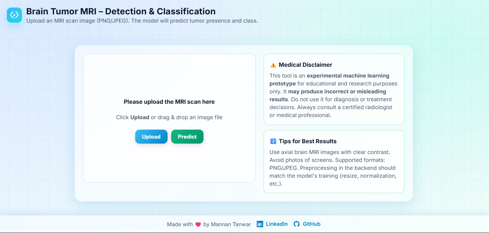

# 🧠 Brain Tumor MRI Classification

<p align="center">
	
</p>

## Table of Contents

- [Project Overview](#project-overview)
- [What are Brain Tumors?](#what-are-brain-tumors)
- [Types of Tumors Used](#types-of-tumors-used)
- [Dataset](#dataset)
- [Tech Stack](#tech-stack)
- [Project Structure](#project-structure)
- [Modular Pipeline & CI/CD](#modular-pipeline--cicd)
- [Model Architecture](#model-architecture)
- [Training & Evaluation](#training--evaluation)
- [Visualizations](#visualizations)
- [How to Run](#how-to-run)
- [Results](#results)
- [Web App](#web-app)
- [Contact](#contact)

---

## Project Overview

This project leverages deep learning to classify brain tumors from MRI scans. It uses a modular, production-grade pipeline with DVC, CI/CD, and a modern tech stack. The goal is to assist radiologists and clinicians in early and accurate tumor detection, improving patient outcomes.

## What are Brain Tumors?

A **brain tumor** is an abnormal growth of cells within the brain or the central spinal canal. Tumors can be benign (non-cancerous) or malignant (cancerous). Early detection is crucial for effective treatment. There are many rumors and misconceptions about brain tumors, but this project focuses on scientific, data-driven classification.

## Types of Tumors Used

This project classifies the following tumor types (as per the dataset):

- **Glioma**: Tumors that originate from glial cells in the brain or spine.
- **Meningioma**: Tumors that arise from the meninges, the membranes that surround the brain and spinal cord.
- **Pituitary Tumor**: Tumors that develop in the pituitary gland.
- **No Tumor**: MRI scans with no evidence of tumor.

## Dataset

- **Source**: [Kaggle - Brain Tumor MRI Dataset](https://www.kaggle.com/datasets/masoudnickparvar/brain-tumor-mri-dataset)
- **Structure**: Images are organized into folders by tumor type and split into Training/Testing sets.
- **Sample Data**:

<p align="center">
	
	<br><i>Sample MRI images with labels</i>
</p>

## Tech Stack

- **Python 3.10+**
- **TensorFlow / Keras**
- **scikit-learn**
- **Pandas, NumPy, Matplotlib, Seaborn**
- **DVC** (Data Version Control)
- **Flask** (for web app)
- **CI/CD**: GitHub Actions
- **Jupyter Notebooks** for research and prototyping
- **KaggleHub** for dataset download

## Project Structure

```text
Brain-Tumor-MRI-Classification/
│
├── artifacts/                # All generated artifacts (data, models, logs)
│   ├── data_ingestion/       # Downloaded and processed data
│   ├── prepare_base_model/   # Saved base models
│   ├── prepare_callbacks/    # Checkpoints and TensorBoard logs
│   └── training/             # Final trained models
│
├── config/                   # YAML configuration files for all stages
│   ├── config.yaml           # Main config for paths and pipeline
│   └── ...
│
├── research/                 # Jupyter notebooks for experiments, EDA, prototyping
│   ├── 01_data_ingestion.ipynb
│   ├── 02_prepare_base_model.ipynb
│   ├── 03_prepare_callbacks.ipynb
│   ├── 04_model_training.ipynb
│   ├── 05_model_evaluation.ipynb
│   └── trials.ipynb
│
├── src/brainTumorMRIClassification/
│   ├── components/           # Modular pipeline components
│   │   ├── data_ingestion.py     # Download and extract data
│   │   ├── prepare_base_model.py # Build and save model
│   │   ├── prepare_callback.py   # Callbacks for training
│   │   ├── training.py           # Training logic
│   │   └── evaluation.py         # Model evaluation
│   ├── config/               # Configuration management (ConfigurationManager)
│   ├── constants/            # Project-wide constants (paths, etc.)
│   ├── entity/               # Data classes for configs (using @dataclass)
│   ├── pipeline/             # Pipeline scripts for each stage (stage_01_data_ingestion.py, ...)
│   ├── utils/                # Utility functions (YAML, logging, etc.)
│   └── __init__.py           # Logger setup
│
├── templates/                # Web app HTML templates (index.html)
├── dvc.yaml                  # DVC pipeline definition (all stages, params, outs, metrics)
├── params.yaml               # Model and training parameters (batch size, epochs, etc.)
├── requirements.txt          # Python dependencies
├── main.py                   # Orchestrates the full pipeline (runs all stages)
├── setup.py                  # Package setup for pip install
└── README.md                 # Project documentation
```

### Key Features of the Structure

- **Separation of Concerns**: Each pipeline stage is a separate script and component, making the codebase easy to maintain and extend.
- **Entity-Driven Configs**: All configuration is handled via dataclasses and YAML, making experiments reproducible and parameter changes easy.
- **Research Notebooks**: All experiments, EDA, and visualizations are versioned in the `research/` folder for transparency.
- **Production-Ready**: The `src/` folder is organized for scalable, testable, and production-grade ML code.
- **Web App Ready**: The `templates/` folder and Flask app allow for easy deployment as a web service.
- **CI/CD & DVC**: The project is ready for continuous integration and reproducible ML with DVC and GitHub Actions.

## Pipeline Stages (Modular Design)

The pipeline is split into four main stages, each with its own script, config, and component:

1. **Data Ingestion** (`stage_01_data_ingestion.py`)

   - Downloads the dataset from Kaggle using KaggleHub
   - Extracts and organizes data into train/test folders
   - Logs all actions for traceability

2. **Prepare Base Model** (`stage_02_prepare_base_model.py`)

   - Builds a custom CNN using Keras Sequential API
   - Saves the base model for reproducibility
   - All hyperparameters are configurable via YAML

3. **Training** (`stage_03_training.py`)

   - Loads the base model and prepares data generators with augmentation
   - Uses modular callbacks (EarlyStopping, ReduceLROnPlateau)
   - Trains the model and saves the best checkpoint
   - Logs training progress and metrics

4. **Evaluation** (`stage_04_evaluation.py`)
   - Loads the trained model and evaluates on the validation/test set
   - Saves metrics (loss, accuracy) to `scores.json` for DVC tracking
   - Supports confusion matrix and advanced metrics

Each stage is fully decoupled and can be run independently or as part of the full pipeline via `main.py` or DVC.

## Technologies & Best Practices Used

- **TensorFlow/Keras**: For deep learning model building and training
- **scikit-learn**: For data shuffling, metrics, and utility functions
- **DVC**: For data and model versioning, pipeline orchestration, and experiment tracking
- **Flask**: For serving the model as a web app
- **PyYAML & python-box**: For robust config management
- **Logging**: Centralized logging to both file and console for all stages
- **CI/CD**: GitHub Actions for automated testing and deployment
- **KaggleHub**: For seamless dataset download from Kaggle
- **Jupyter Notebooks**: For EDA, prototyping, and visualization
- **Modular OOP**: All pipeline logic is encapsulated in classes for reusability
- **Entity-Driven Design**: All configs are strongly typed using Python dataclasses

---

## Modular Pipeline & CI/CD

- **Modular Coding**: Each pipeline stage (data ingestion, model prep, training, evaluation) is a separate, reusable component.
- **DVC**: Ensures reproducibility and versioning of data, models, and experiments.
- **CI/CD**: Automated testing and deployment using GitHub Actions.
- **Logging**: All stages log to both console and file for traceability.

<details>
<summary>Click to see DVC Pipeline</summary>

```yaml
stages:
	data_ingestion:
		cmd: python3 src/brainTumorMRIClassification/pipeline/stage_01_data_ingestion.py
		outs: [artifacts/data_ingestion/brain-mri]
	prepare_base_model:
		cmd: python3 src/brainTumorMRIClassification/pipeline/stage_02_prepare_base_model.py
		outs: [artifacts/prepare_base_model]
	training:
		cmd: python3 src/brainTumorMRIClassification/pipeline/stage_03_training.py
		outs: [artifacts/training/brain_model.h5]
	evaluation:
		cmd: python3 src/brainTumorMRIClassification/pipeline/stage_04_evaluation.py
		metrics: [scores.json]
```

</details>

## Model Architecture

<p align="center">
	
	<br><i>Custom CNN architecture for brain tumor classification</i>
</p>

**Layers:**

- 4 Convolutional layers (with ReLU, MaxPooling)
- Flatten, Dense(512, relu), Dropout(0.4)
- Output: Dense(4, softmax)

**Optimizer:** Adam (lr=0.001, beta_1=0.869, beta_2=0.995)

## Training & Evaluation

- **Augmentation**: Rotation, brightness, shift, shear, flip, etc.
- **EarlyStopping** and **ReduceLROnPlateau** callbacks
- **Batch size**: 32, **Epochs**: 40
- **Validation split**: 20-30%

## Visualizations

<p align="center">
	
	<br><i>True values vs. model predictions</i>
</p>

<p align="center">
	
	<br><i>Confusion Matrix</i>
</p>

<p align="center">
	
	<br><i>Train vs Validation Loss over epochs</i>
</p>

<p align="center">
	
	<br><i>Model Architecture Visualization</i>
</p>

## How to Run

1. **Clone the repo:**
   ```bash
   git clone https://github.com/mannantanwar/Brain-Tumor-MRI-Classification.git
   cd Brain-Tumor-MRI-Classification
   ```
2. **Install dependencies:**
   ```bash
   pip install -r requirements.txt
   ```
3. **Configure Kaggle API** (for dataset download):
   - Place your `kaggle.json` in the appropriate location.
4. **Run the pipeline:**
   ```bash
   dvc repro
   # or run main.py for all stages
   python main.py
   ```
5. **Launch the web app:**
   ```bash
   python app.py
   ```

## Results

- **Accuracy**: Achieved high accuracy on the test set (see confusion matrix and metrics above).
- **Robustness**: Model generalizes well to unseen MRI scans.
- **Reproducibility**: All experiments are tracked and reproducible via DVC.

## Web App

<p align="center">
	
	<br><i>Upload MRI scans and get instant predictions!</i>
</p>

## Contact

- **Author**: Mannan Tanwar
- **LinkedIn**: [Mannan Tanwar](https://www.linkedin.com/in/mannan-tanwar/)
- **GitHub**: [mannantanwar](https://github.com/mannantanwar)

---
